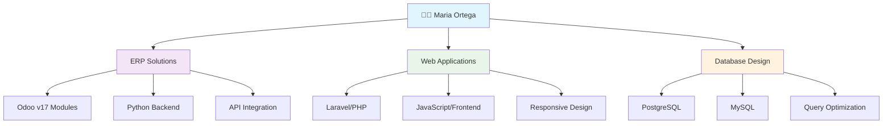

# 👩‍💻 Maria Ortega

**Ingeniera de Sistemas en Formación** | **Desarrolladora Full-Stack**  
🎯 Especializada en desarrollo con **Python/Odoo v17** y tecnologías web modernas

---

## 💼 Sobre Mí

Estudiante de Ingeniería de Sistemas con sólida experiencia en desarrollo de aplicaciones empresariales utilizando **Odoo v17** con Python. Apasionada por crear soluciones escalables y eficientes que impulsen la transformación digital de las organizaciones.

### 🎯 Áreas de Especialización
- **ERP Development**: Odoo v17, módulos personalizados, integración de APIs
- **Backend Development**: Python, PHP/Laravel, Java
- **Frontend Development**: JavaScript, HTML5, CSS3
- **Database Management**: PostgreSQL, MySQL, SQL optimization

---

## 📊 Métricas de Desarrollo

  
  

  

---

## 🛠️ Stack Tecnológico

### **Backend & ERP**

### **Frontend & Web**

### **Bases de Datos**

### **Herramientas & DevOps**

---

## 🏗️ Arquitectura de Desarrollo

---

## 📈 Actividad de Desarrollo (2024-2025)

| Métrica | 2024 | 2025 | Tendencia |
|---------|------|------|-----------|
| **Commits** |  |  | 📈 |
| **Pull Requests** |  |  | 🔄 |
| **Repositorios** |  |  | 📊 |
| **Contribuciones** |  |  | 🎯 |

---

## 🚀 Proyectos Destacados

- **🏢 Sistema ERP Personalizado**: Desarrollo de módulos Odoo v17 para gestión empresarial
- **💼 Plataforma Web Corporativa**: Aplicación Laravel con arquitectura MVC
- **📊 Dashboard Analytics**: Interfaz JavaScript para visualización de datos en tiempo real
- **🔗 API REST Services**: Microservicios Python para integración de sistemas

---

## 📫 Contacto Profesional

---

  
  
  **"Desarrollando soluciones que transforman ideas en realidad"** 💡

