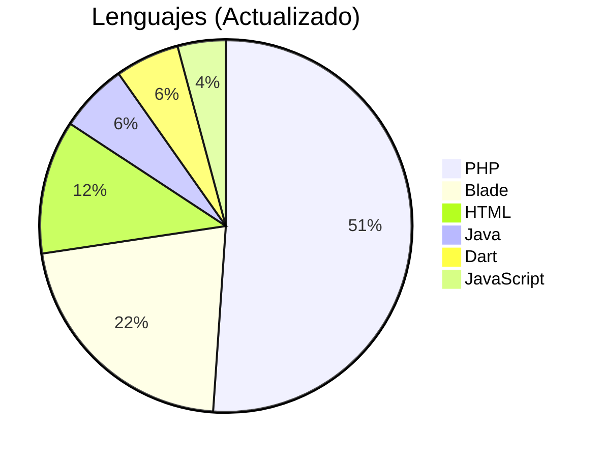

# 👋 ¡Hola! Soy **Maria Ortega**  

### 🎓 Estudiante de Ingeniería en Sistemas  
Apasionada por el **desarrollo full-stack** y las **tecnologías emergentes**. 🚀  

---

## 📊 Dashboard de Actividad GitHub  

  
  
  

## 📅 Evolución Anual Automática  

| Métrica               | 2023 | 2024 | 2025 |
|-----------------------|------|------|------|
| 🏆 **Estrellas**      |  |  |  |
| 💾 **Commits**       |  |  |  |
| 🔄 **Pull Requests** |  |  |  |
| 🐛 **Issues**        |  |  |  |
| 🤝 **Contribuciones**|  |  |  |

## 🛠 Stack Tecnológico Automático  

---

  
  
✨ "Commit a tus sueños diariamente" ✨

## 🛠 Stack Tecnológico  

---

  
  
✨ "Commit a tus sueños diariamente" ✨

